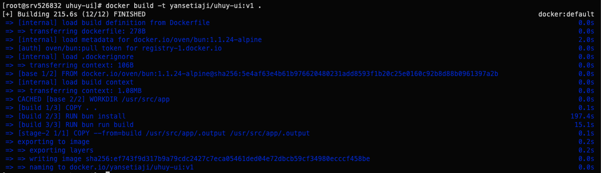
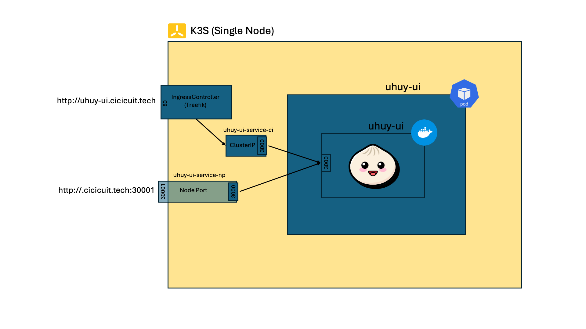
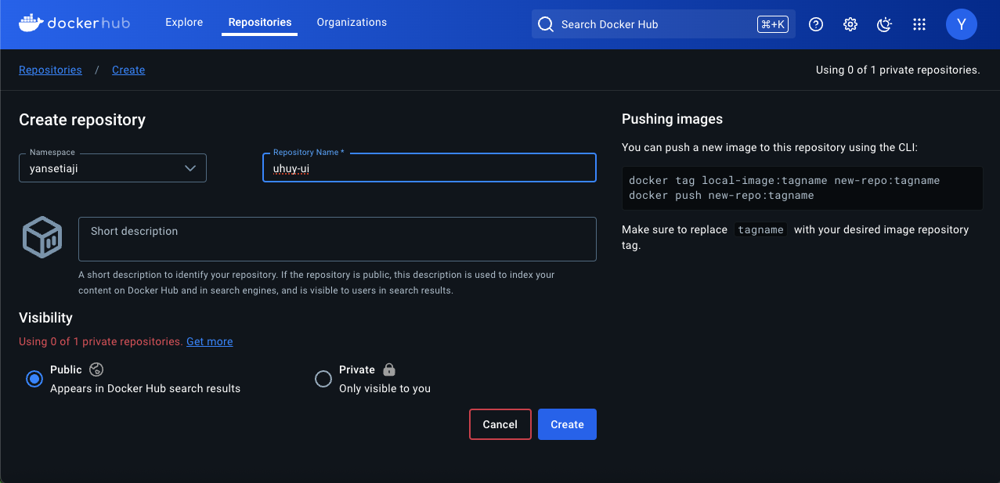
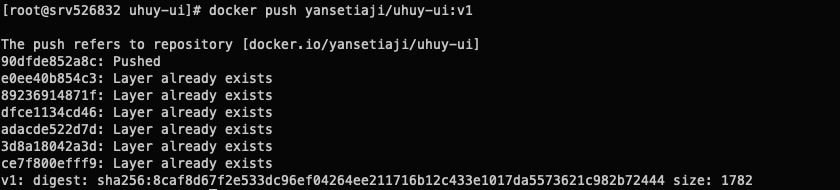
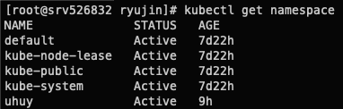
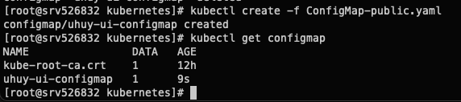
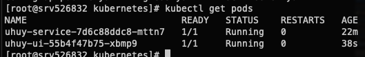
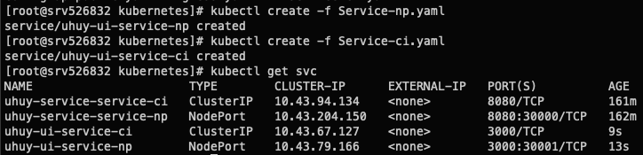
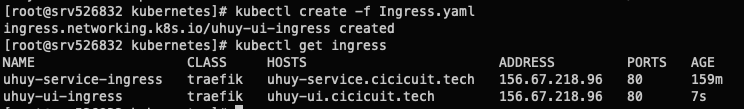

# Uhuy UI

## Public Endpoint (SSL not configured, please use HTTP, or the backend request will be failed)

- Via IngressController: [http://uhuy-ui.cicicuit.tech](http://uhuy-ui.cicicuit.tech)
- Via NodePort: [http://uhuy-ui.cicicuit.tech:30000](http://cicicuit.tech:30001)

## Direct Dependencies/Packages/Modules

- [Nuxt](https://www.npmjs.com/package/nuxt) : Main Frontend Library
- [Vue](https://www.npmjs.com/package/vue) : Used by Nuxt
- [Tailwind CSS](https://www.npmjs.com/package/@nuxtjs/tailwindcss) : Tailwind CSS integration for Nuxt
- [PrimeIcons](https://www.npmjs.com/package/primeicons) : Icons Library
- [VueUse](https://vueuse.org/) : Used for [onClickOutside](https://vueuse.org/core/onClickOutside/) functionality
  - [Core](@vueuse/core)
  - [Nuxt](https://www.npmjs.com/package/@vueuse/nuxt)

## Using the repo

Clone the repository

```bash
git clone https://github.com/yansetiaji/uhuy-ui
cd uhuy-ui
```

For example I use [`bun.js`](https://bun.sh/)

Run instantly at local development server:

```bash
bun install
bun run dev
```

Build as a binary and run:

```bash
bun run build
bun .output/server/index.mjs
```

Build docker image:

```bash
docker build -t <username>/uhuy-ui:<tag> .
```



Run containerized version on localhost:

```bash
docker run -p 3000:3000 <username>/uhuy-ui:<tag>
```

## Kubernetes (K3S) Deployment Visualized



## Step by Step to Kubernetes

### Create image repository at [Docker Hub Repository](https://hub.docker.com)



### Push builded local image to the [Docker Hub Repository](https://hub.docker.com)

Note: login required

```bash
docker push <username>/uhuy-ui:<tag>
```



### Let's go to kubernetes

```bash
cd ./kubernetes
```

Create `uhuy` `namespace`. (Optional, you can use `default` `namespace` instead)

```bash
kubectl create -f Namespace.yaml
```



Change `contexts.context.namespace` in `KUBECONFIG`. (No need to do this if you're using `default` `namespace`)

```yaml
contexts:
- context:
    cluster: default
    user: default
    namespace: uhuy
  name: default
```

## Create ConfigMap

If you use local environment

```bash
kubectl create -f ConfigMap-local.yaml
```

Otherwise use public ConfigMap

```bash
kubectl create -f ConfigMap-public.yaml
```



### Create Deployment

```bash
kubectl create -f Deployment.yaml
```



### Create Service

```bash
kubectl create -f Service-np.yaml
kubectl create -f Service-ci.yaml
```



### Create Ingress

```bash
kubectl create -f Ingress.yaml
```



Access via [Public Endpoint](#public-endpoint)